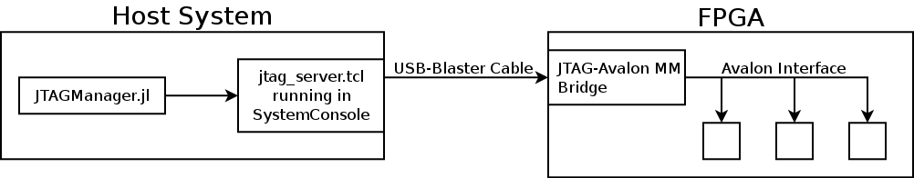

# JTAGManager

[](https://travis-ci.org/hildebrandmw/JTAGManager.jl)
[](https://codecov.io/gh/hildebrandmw/JTAGManager.jl)

A simple package for interfacing with the provided TCL server running in Quartus'
System Console. The main goal of the package is to provide an easier way to 
transfer data from a host system to an Intel FPGA using just the USB-Blaster
cable.

This is achieved using the architecture below:


A JTAG-to-Avalon MM Bridge (an available component provided by Intel via
Platform Designer) is used to allow the JTAG input from the USB-Blaster cable
to serve as a master for the Avalon interface.

Then, a TCL server (courtesy of D.W. Hawkins) is then run in Quartus 
System Console. This server allows any language capable of forming a TCP 
connection to generate read and write commands to the Avalon-MM system. By
default, this server listens on port `2540`.
*Security Note* The server is by default configured to only accept connections
from `127.0.0.1`. You can remove this check in `jtag_server.tcl` at your own 
risk.

The package `JTAGManager` serves as a Julia layer for interacting with this
TCL server.

## Installation

This is an unregistered package. Install using the command
```julia
pkg> add https://github.com/hildebrandmw/JTAGManager.jl
```

## Usage

This package exports a single type `JTAG`, constructed using
```julia
JTAG(ip = ip"127.0.0.1", port = 2540)
```

Contiguous blocks of data can be written using
```julia
write(jtag, address, data)
```
where `address` is the start address of the memory-mapped system and `data` is
the payload. Elements of `data` will be written sequentially to the memory-mapped
system.

To read `bytes` number of bytes from the system, beginning at `address`, use
```julia
read(jtag, address, bytes)
```

## Example
```julia
# Construct a default JTAG object.
julia> jtag = JTAG()
JTAG{IPv4}(ip"127.0.0.1", 2540, false)

# Data to transmit
julia> data = [0x01, 0x02, 0x03]
3-element Array{UInt8,1}:
 0x01
 0x02
 0x03

# Write data, beginning at address 0
julia> write(jtag, 0, data)

# Read back the data we just wrote.
julia> readdata = read(jtag, 0, length(data))
3-element Array{UInt8,1}:
 0x01
 0x02
 0x03

# Close the connection between the TCL server and the Avalon MM system
julia> close(jtag)
false
```

## Running the TCL Server
To run the TCL server, open Quartus and launch System Console 
(Tools -> System Debugging Tools -> System Console). In the TCL window, press
`Ctrl-e` to execute a script. Navigate to `tcl/jtag_server.tcl` and select
that file.
